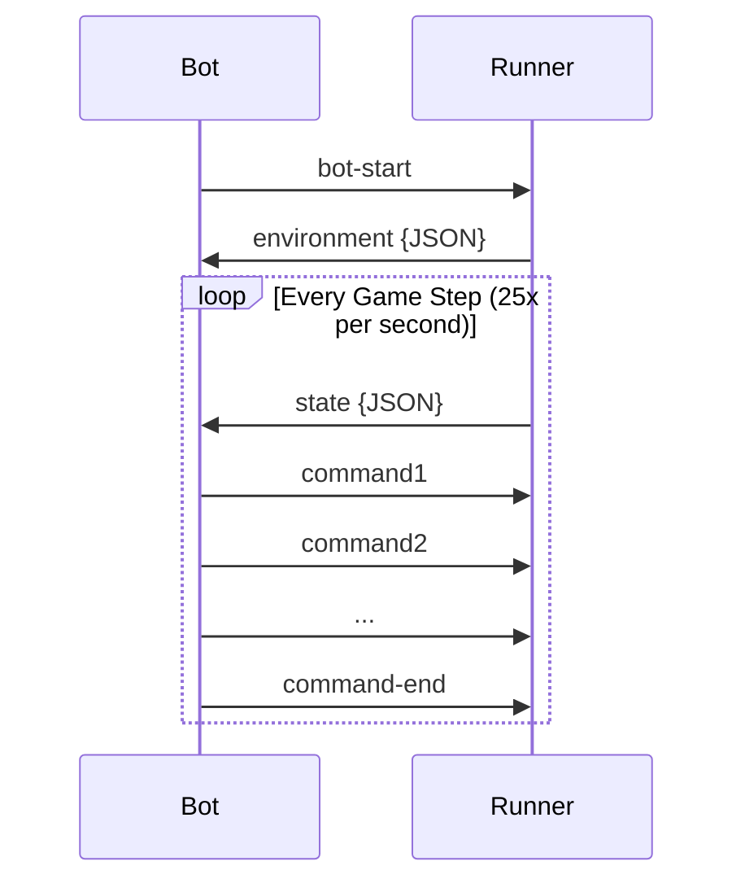

# Gearbots Game Guide

Gearbots is a tank battle game.
Two teams of three bots each play a last tank standing match.
Tanks move around (forward and backward), can rotate their body and turret independently, and fire shells.
Physics are simplified, the battle field is viewed top-down, tanks can not collide.
A team wins by eliminating the last tank from the opposing team.

## Gameplay

- 25 FPS so 40ms per update
- Tanks spawn at random points along a circle on the map, three for each team
- Map size is communicated at the start, defaults to 800 x 800 units
- Tanks move freely within the grid
- Games have a maximum duration of 2 minutes
- Power ups spawn periodically on the map giving back health

Game runner has a timeout of 100ms for each update.
If your bot does not respond within 100ms it will be killed.
Aim for an update time of under 40ms, so that games don't take too long to play.

The word "step", and "update" mean the same thing.

### Your Tank

A tank is made of a body and a turret with scanner on top of it.
The body and turret rotate independently.
Rotating the body of the tank does not rotate the turret with it, the turret by default stays in the same direction.

Movement of the tank is controlled by accelerating (either forwards or backwards), rotating the tank and braking.
The tank always moves in the direction it is facing (so no drifting).

The scanner that is attached to the turret scans continuously.
When it detects something it will be read as an input message.

### Simultaneous Turns

All tanks act simultaneously each step.
Each tank can execute **one** `IStepCommand` (movement, rotations, etc) per step.
Each tank can execute unlimited `ChatCommand` and `LogCommand` commands (within reason).

## Bot Communication

### Overview

Your bot communicates with the game runner via **standard input (stdin)** and **standard output (stdout)**.
Commands are plain text.
Each input will be a single line, so for each update your bot only has to perform one `console.readline` (or whatever it is called in your language).
Your output will be multiple lines. One command per line and end in a special 'end' command to communicate that no more commands will come for this update.

### Communication Flow



1. **Startup**: When your bot is ready, write `bot-start` to stdout
2. **Environment**: You receive a one-time `environment` message with map size and tank info (see below for exact format)
3. **Game Loop**: Each step:
   - Receive `state` message with your tank's current state and scan results (see below for exact format)
   - Send your commands (one per line)
   - Send `command-end` to signal you're done

Your bot has a 1 second timeout to respond. If you don't send `command-end` in time, your tank will be killed!

## Commands Reference

### Movement & Action Commands

Only **one** of these is processed per step:

| Command         | Arguments   | Description                                                                                         |
| --------------- | ----------- | --------------------------------------------------------------------------------------------------- |
| `accelerate`    | none        | Increase velocity by 1 (max 8)                                                                      |
| `reverse`       | none        | Decrease velocity by 1 (min -8)                                                                     |
| `brake`         | none        | Reduce velocity toward 0 by 2                                                                       |
| `rotate`        | `<degrees>` | Rotate tank body (max ±10° at standstill, less when moving). Values outside this range are clamped. |
| `rotate-turret` | `<degrees>` | Rotate turret (max ±10°). Values outside this range are clamped.                                    |
| `fire-gun`      | none        | Fire a shell (requires full gun energy)                                                             |

The exact formula for calculating the maximally allowed rotation is `$rot_{max} - (0.75 * min(v, v_{max}))$`.
`$rot_{max} = 10$` degrees and `$v_{max} = 8$` units/second.
This means that at stand still you can rotate at most 10°/update and when moving at maximum velocity 4°/update.

For rotation commands, positive values rotate clockwise, negative values rotate counter-clockwise.

### Utility Commands

These can be sent alongside movement commands:

| Command | Arguments   | Description                                                                     |
| ------- | ----------- | ------------------------------------------------------------------------------- |
| `chat`  | `<message>` | Send a chat message visible to all (max 50 chars, limited to one per 25 frames) |
| `log`   | `<message>` | Log a debug message (visible in replay)                                         |

### Command Examples

```
rotate 5.5
chat Hello enemy!
log Debug: scanning sector 3
command-end
```

## State Messages

### Environment Message (received once at start)

Received as a single line prefixed with `environment `:

```json
{
  "MapSize": {
    "Width": 800,
    "Height": 800
  },
  "Tanks": [
    {
      "Id": 0,
      "TeamId": 1,
      "Name": "MyBot",
      "TeamName": "TeamAlpha",
      "IsEnemy": false,
      "IsYou": true
    },
    {
      "Id": 1,
      "TeamId": 0,
      "Name": "TheyBot",
      "TeamName": "TeamBeta",
      "IsEnemy": true,
      "IsYou": false
    }
  ]
}
```

| Field              | Description                                             |
| ------------------ | ------------------------------------------------------- |
| `MapSize`          | Width and Height of the battlefield (can vary per game) |
| `Tanks`            | List of all tanks in the game                           |
| `Tanks[].Id`       | Unique identifier for the tank                          |
| `Tanks[].TeamId`   | Unique identifier for the team the tank belongs to      |
| `Tanks[].Name`     | Display name of the tank/bot                            |
| `Tanks[].TeamName` | Display name of the team                                |
| `Tanks[].IsEnemy`  | Whether this tank is an enemy to you                    |
| `Tanks[].IsYou`    | Whether you control this tank                           |

### State Message (received each step)

Received as a single line prefixed with `state `:

```json
{
  "Step": 42,
  "GameResult": "Won",
  "Tank": {
    "Location": { "X": 120, "Y": 341 },
    "Heading": 90.0,
    "TurretHeading": 45.0,
    "Velocity": 5.5,
    "Health": { "Value": 5, "Max": 10 },
    "GunEnergy": { "Value": 15, "Max": 15 },
    "ChatEnergy": { "Value": 25, "Max": 25 }
  },
  "TankScans": [
    {
      "TankId": 1,
      "Name": "Tankard",
      "Location": { "X": 350.0, "Y": 200.0 },
      "Heading": 180.0,
      "TurretHeading": 100.0,
      "Health": { "Value": 6, "Max": 10 },
      "IsEnemy": true
    }
  ],
  "DestroyedTankScans": [
    {
      "TankId": 1,
      "Name": "Tanksgiving",
      "Location": { "X": 350.0, "Y": 200.0 },
      "IsEnemy": true
    }
  ],
  "BulletScans": [
    {
      "BulletId": 21,
      "Location": { "X": 300.0, "Y": 250.0 },
      "Velocity": { "X": 7, "Y": 1 }
    }
  ],
  "PowerupScans": [
    {
      "Id": 3,
      "Location": { "X": 400.0, "Y": 350.0 },
      "Type": "Healing"
    }
  ],
  "Hits": [
    {
      "Damage": 1,
      "TankId": 1,
      "Name": "Tankard"
    }
  ],
  "ChatMessages": [
    {
      "TankId": 1,
      "TeamId": 1,
      "Name": "Tankard",
      "Message": "Incoming!"
    }
  ]
}
```

| Field                           | Description                                                                                     |
|---------------------------------|-------------------------------------------------------------------------------------------------|
| `Step`                          | Current game step number                                                                        |
| `GameResult`                    | Game outcome when the game ends: `"Won"`, `"Lost"`, or `"Tie"` (only present when game is over) |
| `Tank.Location`                 | Your tank's position (`X`, `Y` coordinates)                                                     |
| `Tank.Heading`                  | Direction your tank body is facing (degrees)                                                    |
| `Tank.TurretHeading`            | Direction your turret is facing (degrees)                                                       |
| `Tank.Velocity`                 | Current speed of your tank                                                                      |
| `Tank.Health`                   | Current and max health (`Value`, `Max`)                                                         |
| `Tank.GunEnergy`                | Current and max gun energy (`Value`, `Max`); fire when full                                     |
| `Tank.ChatEnergy`               | Current and max chat energy (`Value`, `Max`); you can chat when full                            |
| `TankScans`                     | Tanks detected in your scan cone                                                                |
| `TankScans[].TankId`            | Unique identifier of the scanned tank                                                           |
| `TankScans[].Name`              | Display name of the scanned tank                                                                |
| `TankScans[].Location`          | Position of the scanned tank (`X`, `Y`)                                                         |
| `TankScans[].Heading`           | Direction the scanned tank is facing (degrees)                                                  |
| `TankScans[].TurretHeading`     | Direction the turrent of the scanned tank is facing (degrees)                                   |
| `TankScans[].Health`            | Health of the scanned tank (`Value`, `Max`)                                                     |
| `TankScans[].IsEnemy`           | Whether the scanned tank is an enemy                                                            |
| `DestroyedTankScans[].TankId`   | Unique identifier of the scanned tank                                                           |
| `DestroyedTankScans[].Name`     | Display name of the scanned tank                                                                |
| `DestroyedTankScans[].Location` | Position of the scanned tank (`X`, `Y`)                                                         |
| `DestroyedTankScans[].IsEnemy`  | Whether the scanned tank is an enemy                                                            |
| `BulletScans`                   | Bullets detected in your scan cone                                                              |
| `BulletScans[].BulletId`        | Unique identifier of the bullet                                                                 |
| `BulletScans[].Location`        | Position of the bullet (`X`, `Y`)                                                               |
| `BulletScans[].Velocity`        | Velocity vector of the bullet (`X`, `Y`)                                                        |
| `PowerupScans`                  | Powerups detected in your scan cone                                                             |
| `PowerupScans[].Id`             | Unique identifier of the powerup                                                                |
| `PowerupScans[].Location`       | Position of the powerup (`X`, `Y`)                                                              |
| `PowerupScans[].Type`           | Type of powerup (e.g., `"Healing"`)                                                             |
| `Hits`                          | Damage received this step                                                                       |
| `Hits[].Damage`                 | Amount of damage taken                                                                          |
| `Hits[].TankId`                 | ID of the tank that hit you                                                                     |
| `Hits[].Name`                   | Name of the tank that hit you                                                                   |
| `ChatMessages`                  | Chat messages from other tanks                                                                  |
| `ChatMessages[].TankId`         | ID of the tank that sent the message                                                            |
| `ChatMessages[].TeamId`         | ID of the tank that sent the message's team                                                     |
| `ChatMessages[].Name`           | Name of the tank that sent the message                                                          |
| `ChatMessages[].Message`        | The chat message content                                                                        |

## Physics & Mechanics

### Movement

- **Rotation Speed**: At standstill you can rotate 10°/step. At max velocity (8), only 4°/step
- **Friction**: Velocity decreases by 2% each step; stops completely below 0.5
- **Map Boundaries**: Hitting the edge stops your tank (velocity becomes 0)

### Combat

- **Gun Cooldown**: Gun energy regenerates 1 per step, requires 15 to fire
- **Bullet Speed**: 15 units per step
- **Bullet Damage**: 1 HP per hit
- **Tank Collision Radius**: 20 units
- **Bullet Collision Radius**: 5 units
- **Friendly fire** is on! Be careful not to hit your buddies.

### Scanning

- Scan cone is 10° wide, centered on turret heading
- Detects tanks, bullets, and powerups
- You receive location, heading, and health of scanned tanks. And most importantly: whether they are friendly or not.

### Powerups

- Spawn every 10 seconds after initial 4 second delay
- **Healing**: Restores 5 HP
- Disappear after 10 seconds if not collected
- Collision radius: 15 units
- Do not interact with bullets
